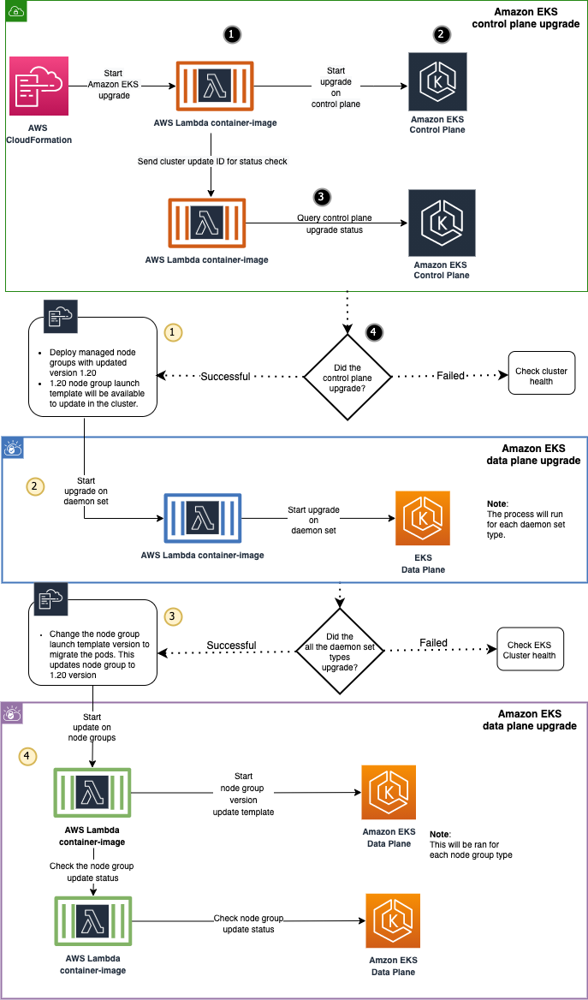

> This sample, non-production-ready template describes managing Amazon EKS with AWS Lambda functions.
(c) 2021 Amazon Web Services, Inc. or its
affiliates. All Rights Reserved. This AWS Content is provided subject to the
terms of the AWS Customer Agreement available at
http://aws.amazon.com/agreement or other written agreement between Customer
and either Amazon Web Services, Inc. or Amazon Web Services
EMEA SARL or both.

# EKS Upgrade
User has an EKS Cluster already setup running above v1.19 with Nodegroups created using launch templates

## Environment Set-up

1. Install awscli, version > 1.18.X
2. Install Docker, version > 20.10.x
3. Install eksctl, version > 0.54.0
4. Install git, version > 2.3X

## Diagram


## Build and Deploy Images

1. Authenticate to ECR Registry where the EKS Cluster is running. ECR repos will be created in next step
```bash
aws ecr get-login-password \
--region <AWS_REGION> | docker login \
--username AWS \
--password-stdin <AWS_ACCOUNT_ID>.dkr.ecr.<AWS_REGION>.amazonaws.com
```

2. Build & push upgrade code images to target ECR Registry
```bash
images/ecr_push_image.sh <AWS_ACCOUNT_ID> <AWS_REGION>
```

## Prerequisites
3. Create AWS Lambda execution role used for lambda container-image to perform the EKS upgrade
```bash
aws cloudformation create-stack \
--stack-name aws-iam-stack \
--template-body file://templates/iam.yml \
--capabilities CAPABILITY_NAMED_IAM
--region <AWS_REGION>
```

4. Update IAM Identity mapping for the Lambda container-image execution IAM role with EKS Cluster
```bash
export CLUSTER_NAME=<CLUSTER_NAME>
export LAMBDA_EXECUTION_ROLE=$(aws cloudformation describe-stacks --stack-name aws-iam-stack --query 'Stacks[*].Outputs[0].OutputValue' --output text --region <AWS_REGION>) 


printenv | awk '/CLUSTER_NAME/||/LAMBDA_EXECUTION_ROLE/{print $0}'

eksctl create iamidentitymapping \
--cluster $CLUSTER_NAME \
--arn $LAMBDA_EXECUTION_ROLE \
--group system:masters \
--username admin \
--region <AWS_REGION>
```
## Start the cluster upgrade
1. Edit the parameters/controlplane-cluster.json file

- EksClusterName: Provide the name of the cluster to be upgraded
- EksUpdateClusterVersion: Provide the EKS version to be upgraded. If current version is v1.19 upgrade to v1.20
- IAMStackName: Provide the IAM stack name created in previous step to get AWS Lambda container-image execution role

2. Create cloudformation stack to trigger the control plane upgrade.
```bash
aws cloudformation create-stack \
--stack-name aws-eks-cluster-upgrade \
--template-body file://templates/controlplane-cluster.yml \
--parameters file://parameters/controlplane-cluster.json \
--capabilities CAPABILITY_AUTO_EXPAND \
--region <AWS_REGION>
```

3. Trigger the daemonset upgrade in the data plane.
- Edit the parameters/dataplane-daemonset.json file
    - EksClusterName: Provide the name of the cluster daemonset to be upgraded
    - IAMStackName: Provide the IAM stack name created in previous step to get AWS Lambda container-image execution role
```bash
aws cloudformation create-stack \
--stack-name aws-eks-daemonset-upgrade \
--template-body file://templates/dataplane-daemonset.yml \
--parameters file://parameters/dataplane-daemonset.json \
--capabilities CAPABILITY_AUTO_EXPAND \
--region <AWS_REGION>
```

4. Trigger the nodegroup update for the cluster
- Edit the parameters/dataplane-nodegroup.yml file
    - EksClusterName: Provide the name of the cluster nodegroup to be updated.
    - EksNodeGroup: Provide the name of the nodegroup 
    - EKSNodeGroupTemplateName: Provide the name of the launch template used for the nodegroup
    - EKSNodeGroupTemplateVersion: The launch template version that needs to be updated.
    - IAMStackName: Provide the IAM stack name created in previous step to get AWS Lambda container-image execution role.
```bash
aws cloudformation create-stack \
--stack-name aws-eks-nodegroup-upgrade \
--template-body file://templates/dataplane-nodegroup.yml \
--parameters file://parameters/dataplane-nodegroup.json \
--capabilities CAPABILITY_AUTO_EXPAND \
--region <AWS_REGION>
```

## Clean up
## Delete CloudFormation stack created for the cluster and nodegroup upgrade.

1. Delete the nodegroup stack
```bash
aws cloudformation delete-stack \
--stack-name aws-eks-nodegroup-upgrade
```

2. Delete the daemonset stack
```bash
aws cloudformation delete-stack \
--stack-name aws-eks-daemonset-upgrade
```

3. Delete the cluster stack
```bash
aws cloudformation delete-stack \
--stack-name aws-eks-cluster-upgrade
```

4. Delete the IAM stack
```bash
aws cloudformation delete-stack \
--stack-name aws-iam-stack
```

5. Delete container images and repository
```bash

images=("controlplane/upgrade" "controlplane/status" "dataplane/daemonset" "dataplane/nodegroup" "dataplane/status")

for app in ${images[*]}; do aws ecr delete-repository --repository-name $app --force || true ; done
```
